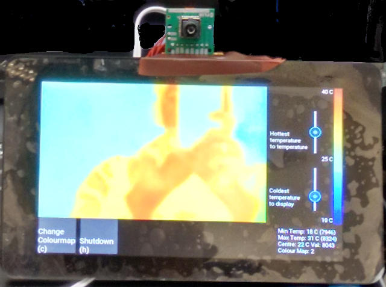

= Raspberry Pi Touchscreen interface for the FLIR Lepton written in Python and Kivy =

Usage:

python LeptonFB.py

Keyboard shortcuts:

s - save image
h - shutdown pi
c - change colour map
d - change between touchscreen and HDMI interface

Known bugs:

Every 5 minutes or so the program freezes up and update stops getting called at the right frequency.
As far as I can tell this is a kivy bug. To work around this the update method detects the time difference and 
exits with a return code of 2. If using run.sh then it will be restarted. 

Running automatically on boot:

The boot.sh and run.sh scripts are designed to be launched by an init script/systemd job. 
It will relaunch LeptonFB.py should it crash or if the user exits requesting a change of display
If the user exits by pressing the shutdown button then a system shutdown is initiated

Streaming output over network:

run.sh tries to start up mjpg_streamer to stream a live MJPG stream on port 8080. This uses a file in /tmp/image.jpg
which contains the latest frame as a jpg file. 

